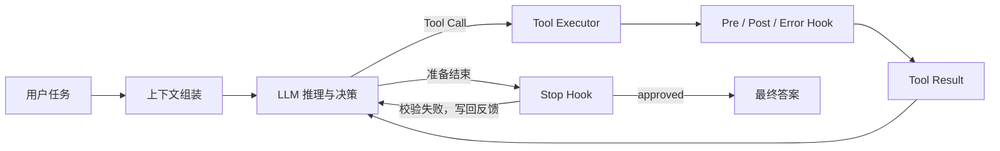
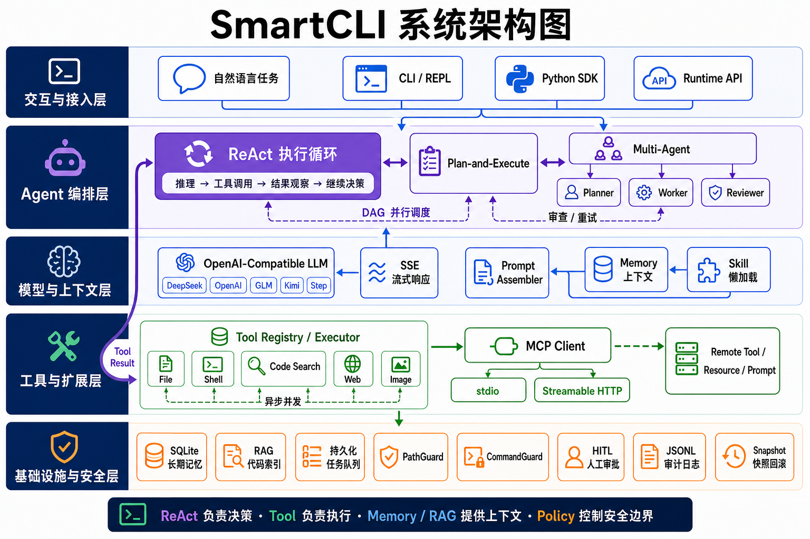
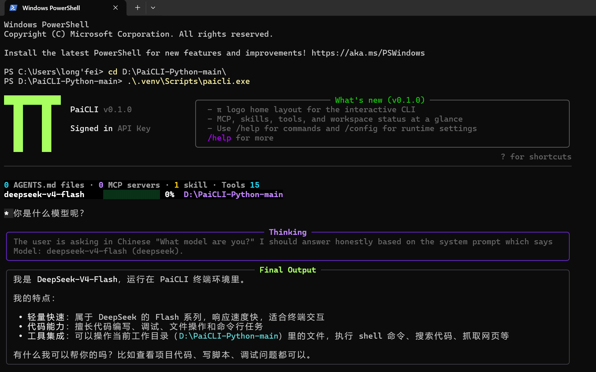

<div align="center">
  <h1>π SmartCLI</h1>
  <p><strong>面向真实软件研发场景的终端 AI 编程智能体</strong></p>
  <p>用 Python 从零实现 Agent Runtime：让模型能够理解项目、规划任务、调用工具、安全修改代码，并对最终结果进行验证。</p>

  <p>
    
    
    
    
    
  </p>
</div>

> SmartCLI 不是简单地把大模型包装进命令行，而是从 **模型接入、ReAct 决策、工具执行、任务编排、代码导航、长短期记忆、安全控制到结果验收**，完整实现了一套可运行、可验证、可扩展的 AI Agent 工程体系。

## 项目概览

SmartCLI 面向代码检索、文件修改、命令执行、联网查询与复杂任务协作场景。模型负责分析与决策，Tool Executor 负责执行真实操作，Memory 与 Code Navigation 提供上下文，Policy/HITL 建立安全边界，Stop Hook 则在任务结束前检查执行证据，形成从自然语言目标到可验证结果的闭环。

```text
SmartCLI = LLM 决策 + Tool 执行 + Memory 上下文 + Policy 边界 + Verifier 验收
```

## Agent 执行闭环



当模型停止调用工具并准备回答时，系统不会立即相信它已经完成任务，而是结合原始需求、最终答案与 Tool Call/Result 证据进行验收；如果文件没有真正修改、命令失败或测试没有通过，反馈会重新进入 ReAct 上下文，驱动 Agent 继续修正。

## 核心工程设计

| 工程问题 | SmartCLI 的解决方案 | 价值 |
| --- | --- | --- |
| 模型提前结束或“口头完成” | 确定性规则 + LLM Reviewer 的 Stop Hook 双层校验 | 最终回答必须有文件、命令或测试证据支撑 |
| Agent 重复调用工具并原地循环 | 对工具名和标准化 JSON 参数生成调用指纹，连续重复时跳过执行并注入纠偏反馈 | 避免无效调用消耗轮次与 Token |
| 长任务上下文持续膨胀 | Token 感知的两级压缩，优先精简历史 Tool Result，再生成结构化任务摘要 | 保留目标、修改和验证证据，同时控制上下文成本 |
| 用户或多个 Agent 并发修改文件 | SHA-256 文件版本校验 + 临时文件原子替换 + Snapshot 恢复 | 以类似乐观锁的方式避免旧内容覆盖新修改 |
| 模型不了解陌生代码仓库 | Repo Map + 符号索引 + ripgrep + ContextLedger 的分层代码导航 | 逐步缩小范围，以工作区实时源码作为最终事实 |
| 复杂任务难以稳定执行 | Plan/Team 共用 DAG 编排内核、全局预算、任务状态与 checkpoint | 支持依赖调度、并行只读任务、审查重试与中断续跑 |
| 审批、审计和异常处理耦合在执行器中 | 可插拔 Pre Tool、Post Tool、Error Hook 生命周期管线 | 不修改执行主流程即可扩展 HITL、审计和结果加工 |
| 外部工具接入方式不统一 | MCP Client/Server，支持 stdio 与 Streamable HTTP、能力发现、分页和会话复用 | 外部 Tool、Resource、Prompt 可以动态注册到 Agent |
| 专项工作流全部塞入 System Prompt | Skill 懒加载、激活屏障、依赖检查与资源按需读取 | 降低常驻上下文，让专项能力独立扩展 |

## 系统架构



## 运行效果



## 功能全景

- 交互式终端 Agent，基于 Rich 和 prompt-toolkit 渲染
- 单次 prompt 模式，适合脚本、管道和自动化调用
- OpenAI-compatible 流式 LLM 客户端，默认面向 DeepSeek 配置
- 支持 `DEEPSEEK_API_KEY` 等 provider-specific API Key
- ReAct 动态执行循环：任务完成时自然结束，并通过轮次、Token、运行时间、重复调用和连续错误预算防止失控
- Plan-and-Execute 与 Multi-Agent 共用一套 DAG 编排内核；只有显式声明且资源不冲突的只读任务才会并行，写操作与命令默认串行
- Multi-Agent 是更严格的 Team 策略层：复用统一 Task/状态/预算/checkpoint 模型，并增加逐任务证据审查与反馈重试
- 内置文件、Shell、grep、glob、记忆、网页搜索、网页抓取、代码搜索等工具
- HITL 人工确认、命令/路径安全策略和 JSONL 审计日志
- MCP client，支持 stdio 和 Streamable HTTP MCP server
- Skill 系统，支持内置、用户级和项目级 skill，支持启用/禁用和 `load_skill` 懒加载注入
- Chrome DevTools MCP 配置助手
- SmartCLI 自身也可以作为 MCP server 暴露内置工具
- Runtime API，支持线程、turn、事件日志和持久化后台任务
- Agentic Code Navigation：Repo Map、统一代码搜索、符号索引、引用查找、上下文去重与增量刷新
- Plan/Team 在任务启动、重试和完成时原子保存状态；预算耗尽或进程中断后可按 run ID 从 `.paicli/runs` 断点续跑
- Agent run 前后自动创建快照，支持恢复现场
- 支持本地图片和远程图片输入，并根据模型能力自动降级

## 环境要求

- Python 3.11 或更新版本
- [uv](https://docs.astral.sh/uv/)
- 可选：`rg`，用于更快的本地搜索
- 可选：Chrome DevTools MCP 需要 Node.js 20.19.0 LTS 或更新版本、npm/npx 和 Chrome

## 快速开始

```bash
git clone https://github.com/jiahuiwu944-hash/SmartCLI.git
cd SmartCLI
uv sync --extra dev
uv run smartcli --help
```

启动交互模式：

```bash
uv run smartcli
```

单次查询：

```bash
uv run smartcli -p "帮我总结这个项目"
```

检查当前环境：

```bash
uv run smartcli doctor --cwd .
```

## 配置

SmartCLI 的配置优先级如下：

1. 内置默认配置
2. `~/.paicli/config.json`
3. 项目级 `.paicli/config.json`
4. 项目级 `.env`
5. CLI 参数
6. 当前进程环境变量

可以像 Java 项目一样，把 DeepSeek Key 写到项目 `.env` 里：

```dotenv
PAICLI_PROVIDER=deepseek
PAICLI_MODEL=deepseek-v4-flash
DEEPSEEK_API_KEY=your_key_here
PAICLI_LLM_MAX_RETRIES=2
PAICLI_LLM_RETRY_BASE_DELAY=0.5
PAICLI_FILE_VERSION_CHECK=warn
PAICLI_ATOMIC_FILE_WRITE=true
PAICLI_CODE_INDEX=true
PAICLI_AUTO_MEMORY=true
PAICLI_AUTO_MEMORY_MIN_CONFIDENCE=0.8
PAICLI_AUTO_MEMORY_MAX_CANDIDATES=3
```

也可以使用兼容的 `PAICLI_API_KEY`：

```dotenv
PAICLI_PROVIDER=deepseek
PAICLI_MODEL=deepseek-v4-flash
PAICLI_API_KEY=your_key_here
```

当前支持的 provider-specific API Key 包括：

- `DEEPSEEK_API_KEY`
- `GLM_API_KEY`
- `STEP_API_KEY`
- `KIMI_API_KEY`

### Stop Hook、循环纠偏与可续跑预算

模型准备结束任务时，SmartCLI 会调用 Stop Hook 审查答案是否完成目标、是否具备工具或测试证据，并在 LLM 审查前确定性拦截“工具被跳过却声称全部完成”等矛盾；审查不通过时，反馈会写回当前上下文并驱动 Agent 继续修正。检测到连续相同的工具和参数时不会立即终止，而是跳过重复执行并要求模型更换参数、工具或方案。

达到轮次或总 Token 上限后，交互终端会询问是否追加预算。ReAct 保留完整消息与工具上下文；Plan/Team 共用全局轮次、Token 和运行时间预算，并把 DAG、任务状态、尝试次数、真实工具证据与预算原子保存到 `.paicli/runs`。可用 `/plan resume [run_id]` 或 `/team resume [run_id]` 恢复最近一次或指定的 `PAUSED`/异常中断 `RUNNING` checkpoint；中文 `继续` 仍然可用。

### 智能代码导航

代码导航分为三层：项目结构未知时使用 `repo_map` 生成小型项目地图；随后通过统一的 `search_code` 入口按 `auto`、`symbol`、`text` 或 `references` 模式查找定义、源码文本和可能的引用；已知文件路径后使用 `document_symbols` 展开文件结构，并以 `read_file` 读取的实时源码为准。符号索引用文件 SHA-256 做增量判断，并在 `write_file` 或 Shell 修改成功后通过 Post Tool Hook 自动刷新；`ContextLedger` 会阻止相同文件版本与行区间被重复注入上下文。

模型服务连接失败、超时或返回 HTTP 错误时，终端仅显示可操作的错误提示，不展开内部堆栈；当前消息和已有工具上下文会保留，连接恢复后可直接输入“继续”。

```dotenv
PAICLI_AGENT_MAX_TURNS=20
PAICLI_AGENT_TOKEN_BUDGET=100000
PAICLI_AGENT_MAX_SECONDS=900
PAICLI_AGENT_REPEAT_LIMIT=3
PAICLI_AGENT_ERROR_LIMIT=3
PAICLI_STOP_HOOK=true
PAICLI_STOP_HOOK_RETRIES=2
PAICLI_AGENT_EXTENSION_TURNS=20
PAICLI_AGENT_EXTENSION_TOKENS=100000
```

### Tool Executor 生命周期 Hook

工具执行器通过统一生命周期 Hook 解耦审批、审计与异常处理：`before_tool` 可修改参数或拒绝调用，`after_tool` 可加工执行结果，`on_tool_error` 可记录异常或转换为模型可理解的反馈。默认 Hook 保留 HITL、JSONL 审计和错误 Tool Result 行为，也可以继续注册自定义 Hook：

```python
from paicli.tools import ToolLifecycleHook, default_tool_hooks


class MetricsHook(ToolLifecycleHook):
    async def after_tool(self, context, result):
        print(context.tool_name, result.is_error)


hooks = default_tool_hooks()
hooks.register(MetricsHook())
# 将 hooks 传给 Agent 或 QueryEngine 的 tool_hook_manager 参数
```

通过命令行临时覆盖 provider 和 model：

```bash
uv run smartcli --provider deepseek --model deepseek-v4-flash
```

连接本地 OpenAI-compatible 服务：

```bash
PAICLI_PROVIDER=openai-compatible \
PAICLI_BASE_URL=http://127.0.0.1:11434/v1 \
PAICLI_MODEL=qwen2.5-coder \
uv run smartcli -p "解释这个仓库"
```

## 交互命令

进入 `uv run smartcli` 后，可以使用这些 slash commands：

```text
/help
/exit
/clear
/context
/memory
/memory search <query>
/memory history [N]
/memory audit [N]
/memory restore <id>
/memory delete <id>
/memory clear
/save <fact>
/config
/tools
/hitl on|off|always|auto|never
/policy
/audit [N]
/index [path]              # incrementally refresh SHA-256/symbol index
/search [--mode auto|symbol|text|references] <query>  # default mode: auto
/plan <task>
/plan resume [run_id]
/team <task>
/team resume [run_id]
/model
/skill
/skill list
/skill show <name>
/skill on <name>
/skill off <name>
/skill reload
/mcp
/task
/task add <task>
/task cancel <task_id>
/task log <task_id>
/snapshot
/snapshot clean
/restore <snapshot-id-or-index>
```

## 内置工具

SmartCLI 内置了一组 Agent 可以调用的本地工具和联网工具：

- `read_file`
- `write_file`
- `list_dir`
- `glob` / `glob_files`
- `grep`
- `bash` / `execute_command`
- `web_search`
- `web_fetch`
- `save_memory`
- `load_skill`
- `search_skills`
- `read_skill_resource`
- `copy_skill_resource`
- `search_code`
- `repo_map`
- `document_symbols`
- `revert_turn`

Skill 采用按需加载：启动时只向模型提供名称和描述，模型调用 `load_skill` 后，
完整的 `SKILL.md` 正文会在当前任务的下一轮 ReAct 前生效，并在新任务开始时清理。
同一轮中的其他工具调用会延后，确保 Skill 指令先于实际操作生效。Skill 可以在
`references/`、`scripts/`、`assets/`、`templates/` 和 `examples/` 中附带资源；模型必须
先激活 Skill，再通过 `read_skill_resource` 按需读取文本资源，长资源可使用 `offset`
续读；二进制资产或需要落到工作区的脚本可通过 `copy_skill_resource` 复制到一个尚不存在的
目标路径。Skill 较多时可使用 `search_skills` 检索。可在 frontmatter 中声明运行依赖：

```yaml
requires:
  tools: [web_search, web_fetch]
  mcp: [chrome-devtools]
```

校验 Skill 目录：

```bash
uv run smartcli skill validate path/to/skill
```

Skill 名称必须与目录名一致，只能使用小写字母、数字和连字符，且必须提供非空的
`name`、`description` 和正文。设置 `PAICLI_SKILL=false` 会从工具表中移除 Skill 工具。

写文件、执行命令、远程 MCP 写操作、恢复快照等危险动作，会经过 policy、HITL 和 audit 处理。

## 联网工具

`web_search` 使用 DuckDuckGo HTML 搜索，返回标题、URL 和摘要。

`web_fetch` 可以抓取公开 HTTP/HTTPS 页面，并做基础正文提取。它会拒绝 `file://`、loopback、私有网络和内网地址，降低 SSRF 风险。

如果需要登录态、浏览器状态或 JS 渲染页面，建议使用 Chrome DevTools MCP。

## MCP

SmartCLI 可以连接 MCP server，并把远端工具动态注册为：

```text
mcp__<server-name>__<tool-name>
```

客户端会并行初始化已启用的 server，并为每个 server 保持一个可复用的 MCP Session；
工具调用发生超时或连接中断时，会按配置进行有限指数退避重连。Tool、Resource 和
Prompt 只会在服务端声明对应 Capability 后注册，列表接口会自动遍历分页结果。

初始化项目级 Chrome DevTools MCP 配置：

```bash
uv run smartcli mcp init-chrome --scope project
```

它会写入 `.paicli/mcp.json`，内容类似：

```json
{
  "mcpServers": {
    "chrome-devtools": {
      "type": "stdio",
      "command": "npx",
      "args": [
        "-y",
        "chrome-devtools-mcp@latest",
        "--isolated",
        "--no-usage-statistics"
      ],
      "timeout": 30,
      "max_retries": 1,
      "retry_base_delay": 0.25
    }
  }
}
```

连接已有 remote-debugging Chrome：

```bash
uv run smartcli mcp init-chrome \
  --scope project \
  --browser-url http://127.0.0.1:9222
```

查看已配置的 MCP server：

```bash
uv run smartcli mcp list
```

把 SmartCLI 自身作为 MCP server 暴露：

```bash
uv run smartcli mcp serve --transport stdio
uv run smartcli mcp serve --transport http --port 3000
```

HTTP smoke：

```bash
curl -sS -X POST http://127.0.0.1:3000 \
  -H 'content-type: application/json' \
  -d '{"jsonrpc":"2.0","id":1,"method":"tools/list","params":{}}'
```

Chrome DevTools MCP 会把浏览器页面和 DevTools 状态暴露给 Agent。不要随意把包含个人账号、敏感数据或生产后台的 Chrome 会话授权给 Agent。

## Runtime API

SmartCLI 内置轻量 Runtime API，适合外部系统接入线程、turn、事件和后台任务。

启动服务：

```bash
PAICLI_RUNTIME_API_KEY=dev-key \
uv run smartcli serve --http --port 8080
```

创建线程：

```bash
curl -sS -X POST http://127.0.0.1:8080/v1/threads \
  -H 'x-api-key: dev-key'
```

发送 turn：

```bash
curl -sS -X POST http://127.0.0.1:8080/v1/threads/<thread_id>/turns \
  -H 'content-type: application/json' \
  -H 'x-api-key: dev-key' \
  -d '{"message":"总结这个项目"}'
```

读取事件：

```bash
curl -sS http://127.0.0.1:8080/v1/threads/<thread_id>/events \
  -H 'x-api-key: dev-key'
```

创建并查看后台任务：

```bash
curl -sS -X POST http://127.0.0.1:8080/v1/tasks \
  -H 'content-type: application/json' \
  -H 'x-api-key: dev-key' \
  -d '{"message":"后台总结这个仓库"}'

curl -sS http://127.0.0.1:8080/v1/tasks \
  -H 'x-api-key: dev-key'
```

## 图片输入

SmartCLI 支持在 prompt 里引用图片：

```text
分析这张截图 @image:./screenshots/page.png
```

也支持绝对路径和远程图片：

```text
解释这张图 @image:/Users/me/Desktop/diagram.png
看看这个图片 @image:https://example.com/image.png
```

本地图片会自动压缩、缩放，并在需要时把透明底铺成白底，再转为 data URL。如果当前 provider/model 不支持多模态输入，SmartCLI 会自动降级为文本元信息，不会把不支持的图片 payload 发给模型。

## 快照

每次 Agent run 都会尽力创建项目快照：

- `pre-turn`
- `post-turn`

快照保存在 `~/.paicli/snapshots/`，不会写入项目 `.git`。

REPL 中可以使用：

```text
/snapshot
/restore 1
/snapshot clean
```

## SDK

```python
from paicli.sdk import create_default_engine

engine = create_default_engine(cwd=".")
result = engine.ask_complete("解释这个项目")
print(result.text)

plan_result = engine.plan_complete("先读取 README，再总结项目结构")
team_result = engine.team_complete("让多个 Agent 并行检查核心模块")
```

## 开发

安装开发依赖：

```bash
uv sync --extra dev
```

运行检查：

```bash
uv run python -m ruff check .
uv run python -m ruff format --check .
uv run python -m pytest
uv build
```

常用 smoke：

```bash
uv run smartcli --version
uv run smartcli --help
uv run smartcli doctor --cwd .
uv run smartcli --plain -p hello
```

## License

MIT. See [LICENSE](LICENSE).
